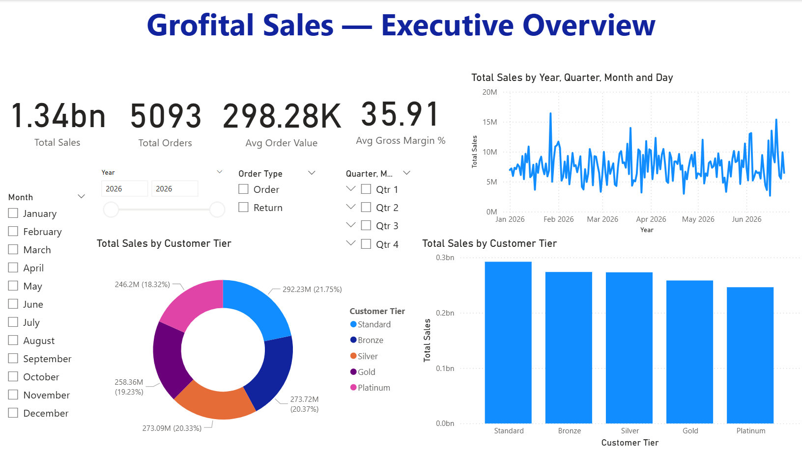
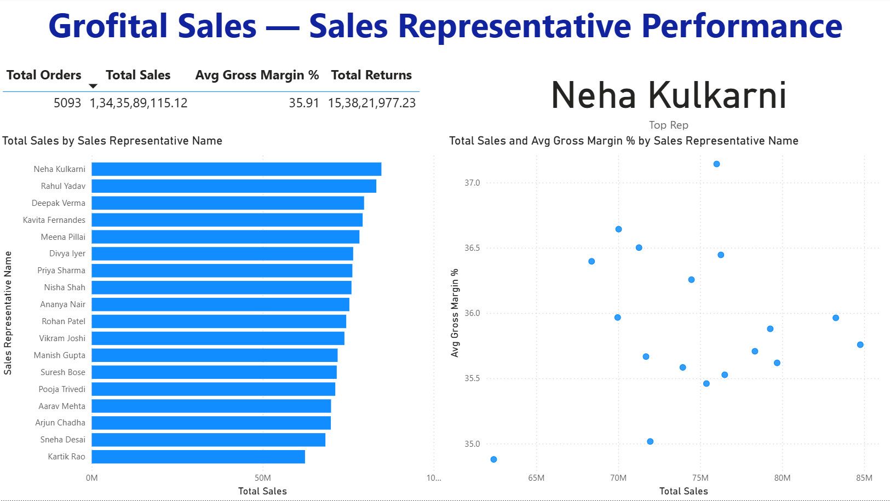
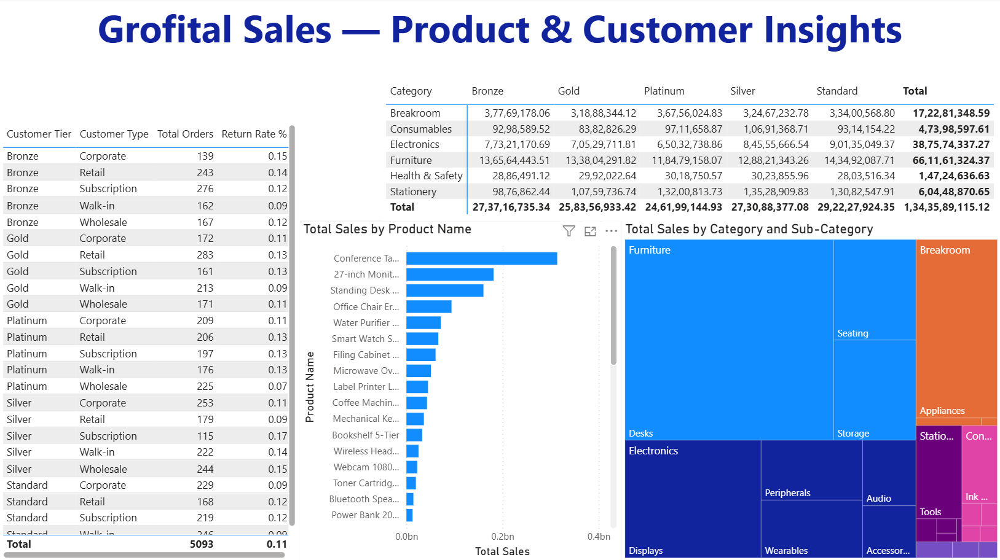

# 📊 Power BI Sales Analytics Dashboard

## Project Overview

This project demonstrates an end-to-end Business Intelligence solution developed using Microsoft Power BI.

The objective was to transform raw sales data into meaningful business insights through data cleaning, data modeling, DAX calculations, and interactive dashboards.

---

## Business Problem

The raw dataset contained:

- Embedded subtotal rows
- Blank company names
- Inconsistent date formats
- Multiple source sheets

The objective was to clean the data and build an executive dashboard for decision making.

---

## Tools Used

- Microsoft Power BI
- Power Query
- DAX
- Microsoft Excel

---

## Skills Demonstrated

- Data Cleaning
- Data Transformation
- Data Modeling
- Star Schema
- DAX
- KPI Development
- Dashboard Design
- Business Intelligence

---

## Dashboard Pages

## 📊 Executive Overview

---

## 👨‍💼 Sales Representative Performance

---

## 📦 Product & Customer Insights

---

### Executive Overview

- Total Sales
- Total Orders
- Average Order Value
- Monthly Sales Trend

### Sales Representative Analysis

- Top Performing Representatives
- Gross Margin Analysis
- Sales Comparison

### Product & Customer Insights

- Category Analysis
- Customer Segmentation
- Product Performance
- Return Rate Analysis

---

## Key Business Insights

- Identify top-performing sales representatives.
- Monitor monthly sales trends.
- Analyze customer purchasing behaviour.
- Evaluate product category performance.

---

## Repository Contents

- Power BI Dashboard (.pbix)
- Cleaned Excel Dataset
- Dashboard Screenshots
- Documentation

---

## Author

**Kartik Chourasia**

MBA | Business Analytics

Open to Data Analyst and Business Analyst opportunities.
